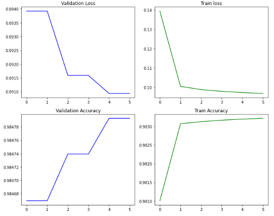
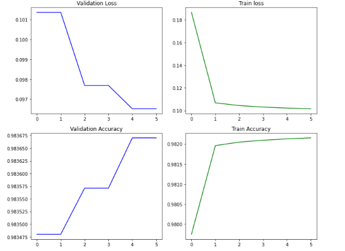

# Coding Assignment #2

In this assignment, you will implement a neural language model that produces word embeddings based on the original [Word2Vec](https://arxiv.org/abs/1301.3781) paper.

## Model - Continuous Bag of Words 

## Architecture  

1. Embedding Layer  
2. Linear Layer 

## Dimensions  
1. 256 embedding dimension
2. 3000 vocab_size
3. MAXNORM =1

## Loss Function and Optimizer  
1. CrossEntropy
2. Adam Optimizer with learning_rate = 0.01

## Training Loop  
1. Epochs = 6 (training for each epoch was taking 15 minutes. Could be reduced with lesser padding)
2. Validation every 2 epochs
3. Save model every 2 epochs

## Results  (Contains bonus task as well where context window of 2 is compared with context window of 4.)
1. With context = 4 and batch size = 256 and embedding =256  
    
Analogy task evaluation  
 
Words not found ->  minister and slaves

2. With context = 4 and batch size = 256 and embedding = 128 
Analogy task evaluation  
 


3. With context = 2 and batch size = 256
  
Analogy task evaluation  


## Analysis (Contains bonus task as well where context window of 2 is compared with context window of 4)  
1. The metrics used here are Mean Rank Reciprocal and Mean Rank. The Mean Reciprocal rank is a statistic measure for evaluating any process that produces a list of possible responses to a sample of queries. Higher it is the better.  Mean Rank is the mean of the ranks of all the predictions that are closest to the correct answer. Lower the score better the performance.
   
2. Taking a look at the results we see that the metrics when context window is 2 are better than when context window is 4. This maybe because the number of epochs are same and for the same number of epochs learning with context window 2 is faster than with a window of 4 . The performance may increase if number of epochs are increased.

3. Comparing semantic tasks vs syntactic tasks:  
For both scenarios, model performance on syntactic tasks is superior to semantic tasks.


## Train model

```
Train:
python train.py \
    --in_data_fn=lang_to_sem_data.json \
    --model_output_dir=experiments/lstm \
    --batch_size=1000 \
    --num_epochs=100 \
    --val_every=5 \
    --force_cpu 

Evaluation:
python train.py \
    --in_data_fn=lang_to_sem_data.json \
    --model_output_dir=experiments/lstm \
    --batch_size=1000 \
    --num_epochs=100 \
    --val_every=5 \
    --force_cpu \
    --eval


# add any additional argments you may need
# remove force_cpu if you want to run on gpu
```


